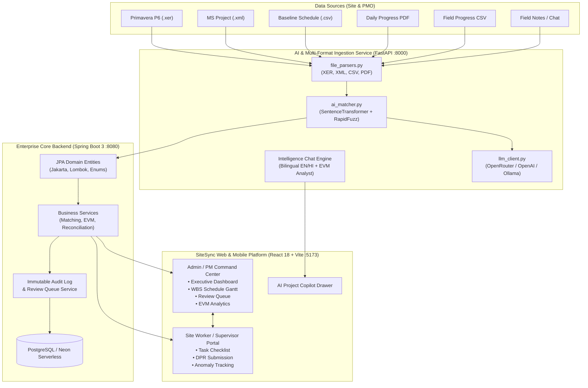

# 🏗️ SiteSync — AI-Powered Construction & EPC Schedule Intelligence

> **Smart India Hackathon (SIH 2026)** | **Problem Statement ID:** `SIH26122`  
> **Domain:** AI-Powered Construction, EPC & Oil/Gas Project Schedule & Progress Tracking Intelligence  
> **Repository:** [https://github.com/ayerohan/sih2026.git](https://github.com/ayerohan/sih2026.git)

---

[](https://www.sih.gov.in/)
[](https://fastapi.tiangolo.com/)
[](https://react.dev/)
[](https://www.typescriptlang.org/)
[](https://spring.io/projects/spring-boot)
[](https://www.python.org/)
[](https://www.oracle.com/java/)
[](https://tailwindcss.com/)
[](https://www.postgresql.org/)

---

## 📌 Executive Summary

Mega infrastructure projects (oil and gas pipelines, refineries, metro rail, thermal power plants, highways) routinely suffer **20% to 50% schedule overruns and millions of dollars in liquidated damages**. 

The root cause is a fundamental informational disconnect:
1. **The Planning Office** maintains master baseline engineering schedules with thousands of Work Breakdown Structure (WBS) activities across Level 1 to Level 6 using specialized tools (**Primavera P6 `.xer`**, **MS Project `.xml`**, Enterprise CSVs).
2. **The Construction Site** produces raw, unstructured **Daily Progress Reports (DPRs)** in disparate formats (**PDFs**, contractor spreadsheets, field notes, shift logs, photos).
3. **The Gap:** Project engineers spend **3 to 7 days manually sifting through PDFs and spreadsheets**, attempting to map daily field progress back to Primavera activity IDs. By the time discrepancies are found, critical path delays are already irreversible.

**SiteSync** solves this challenge by delivering an end-to-end autonomous AI ingestion, matching, and reconciliation pipeline that connects site reality with master engineering schedules in real time, backed by an immutable human-in-the-loop governance audit trail.

---

## ⚡ Core Capabilities & Innovations

```
       MASTER SCHEDULES                                       SITE DAILY PROGRESS REPORTS
 (Primavera .xer, MS Project .xml, CSV)                     (DPR PDF, Field Logs, Contractor CSV)
                  │                                                         │
                  ▼                                                         ▼
       ┌──────────────────────┐                                  ┌──────────────────────┐
       │ Multi-Format Parser  │                                  │ Multimodal Extractor │
       │ WBS Level 1-6 Engine │                                  │ (pdfplumber, NLP/LLM)│
       └──────────┬───────────┘                                  └──────────┬───────────┘
                  │                                                         │
                  │              ┌───────────────────────────┐              │
                  └─────────────►│ Multi-Tier AI Matcher     │◄─────────────┘
                                 │ • Exact Activity Code     │
                                 │ • Domain Keyword Boost    │
                                 │ • RapidFuzz Token Overlap │
                                 │ • SentenceTransformer     │
                                 └─────────────┬─────────────┘
                                               │
                                               ▼
                             ┌───────────────────────────────────┐
                             │    Confidence Scoring Engine      │
                             └───────┬───────────────────┬───────┘
                     Score >= 0.75   │                   │ Score < 0.75
                                     ▼                   ▼
                          ┌──────────────────┐   ┌───────────────────┐
                          │   Auto-Linked    │   │ Supervisor Review │
                          │ Physical Progress│   │   Queue & Audit   │
                          └──────────────────┘   └───────────────────┘
                                     │                   │
                                     └─────────┬─────────┘
                                               ▼
                                  ┌─────────────────────────┐
                                  │ EVM Variance & Delays   │
                                  │ CPI, SPI, S-Curve Alert │
                                  └─────────────────────────┘
```

### 1. Multi-Format Baseline Schedule Ingestion
- **Primavera P6 (`.xer`):** Native parser dissects `%T TASK`, `%T PROJWBS`, and `%T ACTVTYPE` tables into structured activity records with planned start/finish dates, percent complete, WBS levels, and engineering disciplines.
- **Microsoft Project (`.xml`):** Parses XML tree nodes (`<Task>`, `<UID>`, `<Name>`, `<PercentComplete>`, `<Start>`, `<Finish>`, `<OutlineLevel>`).
- **Master Baseline CSVs:** Direct parsing of multi-column WBS hierarchies with planned quantities and weightages.

### 2. Multi-Format Field DPR Ingestion & Extraction
- **PDF DPRs:** Uses `pdfplumber` with table heuristics and regex fallbacks to parse daily site logs, contractor-wise skilled/unskilled labor counts, equipment usage, and progress remarks.
- **Contractor CSVs:** Instant extraction of daily physical quantities, work descriptions, and manpower.
- **Discrete Event Generation (`ExtractedEvent`):** Turns unstructured report text into granular work events with discipline, location (e.g., KP corridor), unit of measurement (cum, rmt, MT, sqm), and extraction confidence.

### 3. Four-Tier AI Activity Matching Engine
SiteSync does not rely on naive keyword matching or hallucination-prone LLMs alone. It executes a deterministic-to-semantic scoring pipeline:
1. **Exact Code Match:** Instant lookup on explicit WBS/task tags (e.g. `CIV-1001`, `PIPE-L6-001`) with **0.98 confidence**.
2. **Domain Keyword & Discipline Weighting:** Heuristics tuned for civil, piping, structural, mechanical, electrical, and QA/QC domains (e.g. *excavation, hydrotest, shuttering, stringing, NDT, switchgear*).
3. **Fuzzy Token Overlap (`rapidfuzz`):** Normalized Levenshtein distance and token sort ratios for site naming variations.
4. **Dense Semantic Embeddings:** SentenceTransformer (`all-MiniLM-L6-v2`) dense vector embeddings capturing semantic intent when terminology differs between site crew and planning engineers.

### 4. Automated Progress Reconciliation & Earned Value Management (EVM)
- Automatically computes **Actual Physical Completion Percentage** per activity.
- Calculates **Schedule Variance (SV)** and **Cost Performance Index (CPI) / Schedule Performance Index (SPI)**.
- Flags lagging activities on the critical path before they impact downstream milestones.

### 5. Human-in-the-Loop Review Queue & Immutable Audit Trail
- Configurable confidence threshold (default: `0.75`).
- High-confidence events are auto-accepted and applied to project progress.
- Ambiguous matches (<0.75) are quarantined into the **Supervisor Review Queue** with side-by-side comparison, confidence breakdown, and 1-click Accept / Modify / Reject.
- Every automated link and manual override is recorded in an immutable `AuditLog` table.

### 6. Bilingual AI Project Copilot (English & Hindi)
- Built-in conversational intelligence drawer powered by specialized project data heuristics + optional OpenAI/OpenRouter LLM fallback.
- Answers complex queries regarding **EVM metrics, delayed activities, supervisor allocations, contractor workforce numbers, and pipeline engineering standards (API 1104, ASME B31.4/B31.8)**.
- Generates on-demand SQL queries and Python EVM calculation snippets.

---

## 🏛️ System Architecture



---

## 📁 Repository Structure

```
sih2026/
├── run.bat                             # One-click startup runner for Windows
├── ai-service/                         # FastAPI AI Engine & Multi-Format Ingestion
│   ├── app/
│   │   ├── __init__.py
│   │   ├── ai_matcher.py               # SentenceTransformer + rapidfuzz scoring engine
│   │   ├── config.py                   # Environment settings & config
│   │   ├── extraction.py               # Field event entity extraction routines
│   │   ├── file_parsers.py             # Parsers for .xer, .xml, .csv, and .pdf
│   │   ├── llm_client.py               # OpenRouter / OpenAI multi-provider wrapper
│   │   ├── main.py                     # FastAPI REST API & Chat Engine (Port 8000)
│   │   ├── matching.py                 # Core matching rules & scoring heuristics
│   │   ├── processor.py                # Ingestion-to-reconciliation pipeline
│   │   ├── prompts.py                  # Structured extraction & EVM prompts
│   │   └── schemas.py                  # Pydantic v2 validation models
│   ├── .env.example                    # Sample environment variables
│   ├── README.md                       # AI Service documentation
│   └── requirements.txt                # Python dependencies
│
├── sitesync-platform/
│   ├── run-prototype.bat               # Subfolder prototype runner
│   │
│   ├── oil-industries/                 # Primary Frontend (React 18 + Vite + TS)
│   │   ├── src/
│   │   │   ├── components/             # Reusable UI tokens, Navbar, AI Intelligence Drawer
│   │   │   ├── context/                # Auth & Project State context
│   │   │   ├── data/                   # Default WBS & baseline dataset
│   │   │   ├── pages/
│   │   │   │   ├── admin/              # Dashboard, Schedule, Progress, ReviewQueue, Analytics
│   │   │   │   ├── worker/             # Worker Portal, DPR Submission, Task Checklists
│   │   │   │   ├── IntelligenceChatPage.tsx # Fullscreen AI Analytics Chat
│   │   │   │   ├── LoginPage.tsx       # Role-based Authentication
│   │   │   │   └── SignupPage.tsx
│   │   │   ├── services/
│   │   │   │   ├── aiEngine.ts         # Client-side NLP & entity parser fallback
│   │   │   │   ├── apiService.ts       # Backend & FastAPI proxy integration
│   │   │   │   └── supabaseClient.ts   # Supabase client setup
│   │   │   ├── types/                  # TypeScript domain models
│   │   │   └── utils/                  # Formatting & math utilities
│   │   ├── supabase_schema.sql         # Supabase PostgreSQL schema with RLS
│   │   ├── tailwind.config.js          # Industrial dark/light theme config
│   │   ├── vite.config.ts              # Vite server & /api proxy to FastAPI
│   │   └── package.json
│   │
│   ├── sample_files/                   # Real-world benchmark test files
│   │   ├── sample_primavera_schedule.xer # Real Primavera P6 schedule export
│   │   ├── sample_msproject_schedule.xml # Real Microsoft Project 2016+ XML schedule
│   │   ├── sample_baseline_schedule.csv  # 10-activity baseline schedule sheet
│   │   └── sample_dpr_progress.csv       # Multi-contractor site daily progress log
│   │
│   └── construction-dashboard/         # Standalone lightweight DPR PDF dashboard prototype
│       ├── backend/                    # Python pdfplumber API
│       └── frontend/                   # React prototype
│
└── sihbackend/                         # Enterprise Spring Boot 3 Backend
    ├── src/main/java/com/sihbackend/
    │   ├── controller/                 # REST Controllers (Progress, Schedule, Matches, Reviews)
    │   ├── dto/                        # Request / Response transfer records
    │   ├── entity/                     # Jakarta JPA Entities (ScheduleActivity, ActivityMatch, etc.)
    │   ├── enums/                      # ActivityLevel, ActivityStatus, MatchStatus, ProcessingStatus
    │   ├── exception/                  # Global API error handlers & resource exceptions
    │   ├── repository/                 # Spring Data JPA Repositories
    │   └── service/                    # Business services (Matching, Extraction, EVM Updates, Audit)
    ├── src/main/resources/
    │   └── application.properties      # PostgreSQL / Neon DB configuration
    ├── mvnw / mvnw.cmd                 # Maven wrapper scripts
    └── pom.xml                         # Java 17 + Spring Boot 3 dependencies
```

---

## 🗄️ Standardized Domain Model & Entities

The following canonical models maintain unified schema naming across the Python AI Engine, Java JPA, TypeScript types, and PostgreSQL:

| Entity Name | Description | Key Attributes |
| :--- | :--- | :--- |
| **`Project`** | Root project tracking entity | `id`, `name`, `code`, `client`, `location`, `status`, `budget` |
| **`Schedule`** | Master schedule baseline version | `id`, `project_id`, `versionName`, `sourceType` (XER/XML/CSV), `uploadedAt` |
| **`ScheduleActivity`** | Level 1 to Level 6 WBS task | `activityCode`, `activityName`, `discipline`, `plannedProgress`, `actualProgress`, `plannedStart`, `plannedFinish`, `level` (L1-L6) |
| **`ProgressReport`** | Field DPR document record | `id`, `project_id`, `reportDate`, `submittedBy`, `rawText`, `sourceDocumentId`, `processingStatus` |
| **`ExtractedEvent`** | Discrete construction event | `activityDescription`, `discipline`, `location`, `eventDate`, `progressPercentage`, `extractionConfidence`, `extractedData` (jsonb) |
| **`ActivityMatch`** | AI link between Event & Activity | `extractedEvent`, `scheduleActivity`, `matchScore` (BigDecimal), `matchingMethod`, `status` (`AUTO_LINKED`, `PENDING_REVIEW`, `REJECTED`) |
| **`ActualProgress`** | Reconciled physical progress record | `scheduleActivity`, `extractedEvent`, `progressPercentage`, `actualStart`, `actualFinish`, `updatedBy` |
| **`Review`** | Human-in-the-loop supervisor action | `activityMatch`, `reviewer`, `action` (`APPROVED`, `MODIFIED`, `REJECTED`), `comments`, `reviewedAt` |
| **`AuditLog`** | Immutable system & user audit trail | `actionType`, `entityName`, `entityId`, `oldValue`, `newValue`, `performedBy`, `timestamp` |

---

## 🛠️ Technology Stack Breakdown

| Layer | Technology | Version | Purpose |
| :--- | :--- | :--- | :--- |
| **Frontend UI** | React, TypeScript, Vite | React 18, Vite 6, TS 5.7 | High-performance industrial responsive command center |
| **Styling & Icons** | Tailwind CSS, Lucide React | Tailwind 3.4, Lucide 0.475 | Clean dark/light theme, accessible dashboards, responsive UI |
| **Visualizations** | Recharts, Framer Motion | Recharts 2.15, Framer 11 | EVM S-curves, progress distributions, interactive timelines |
| **AI Ingestion Engine**| FastAPI, Uvicorn | FastAPI 0.110+, Python 3.10+ | High-throughput async ingestion and multi-format parsing |
| **NLP & Matching** | SentenceTransformers, RapidFuzz | `all-MiniLM-L6-v2`, RapidFuzz 3 | Semantic dense vector search and fuzzy token scoring |
| **Document Parsers** | pdfplumber, xml.etree, csv | Python 3.10 standard / PyPI | Direct binary extraction of Primavera XER, MS Project XML, PDF |
| **Enterprise Backend** | Spring Boot 3, Java 17 | Spring Boot 3.x / 4.x, Java 17 | Enterprise ACID transactions, JPA ORM, and secure API tier |
| **Database** | PostgreSQL / Neon Serverless | Postgres 15+ / Neon Pooler | Relational persistence with JSONB support and foreign key constraints |

---

## 🚀 Quickstart & Setup Guide

### Prerequisites
- **Node.js:** v18.0+ & `npm` v9+
- **Python:** v3.10+ & `pip`
- **Java:** JDK 17+ (Optional for Spring Boot backend)
- **Git:** Installed and available in PATH

---

### Method A: One-Click Instant Launch (Windows)

Simply double-click `run.bat` in the repository root (or run it via command prompt):

```cmd
run.bat
```

This single command automatically:
1. Spawns the **FastAPI AI & Multi-Format Ingestion Engine** on `http://localhost:8000`.
2. Spawns the **SiteSync Frontend Platform** on `http://localhost:5173`.
3. Opens your default web browser directly to the dashboard.

---

### Method B: Manual Step-by-Step Setup

#### Step 1: Launch the AI Service (FastAPI)
```powershell
cd ai-service

# Create and activate virtual environment
python -m venv venv
.\venv\Scripts\activate   # On Linux/macOS: source venv/bin/activate

# Install dependencies
pip install -r requirements.txt

# (Optional) Setup environment keys for external LLM fallback
Copy-Item .env.example .env

# Start FastAPI server
python -m uvicorn app.main:app --host 0.0.0.0 --port 8000 --reload
```
*AI Service is now running on **`http://localhost:8000`** (Swagger docs: **`http://localhost:8000/docs`**).*

#### Step 2: Launch the Frontend Platform (React + Vite)
```powershell
cd sitesync-platform\oil-industries

# Install npm packages
npm install

# Start development server
npm run dev
```
*Frontend is now running on **`http://localhost:5173`**.*

#### Step 3: (Optional) Launch the Enterprise Java Backend (Spring Boot 3)
```powershell
cd sihbackend

# Run automated tests
.\mvnw.cmd test

# Run Spring Boot service
.\mvnw.cmd spring-boot:run
```
*Backend is now running on **`http://localhost:8080`**.*

---

## 🧪 Testing with Real Sample Datasets

The repository includes pre-packaged, authentic construction files in `sitesync-platform/sample_files/` ready for immediate evaluation:

| Sample File | Format | Test Scenario |
| :--- | :--- | :--- |
| **`sample_primavera_schedule.xer`** | Primavera P6 XER | Real industrial schedule with `%T TASK` records, WBS hierarchy, and early start dates. Upload to Schedule Import to test XER parsing. |
| **`sample_msproject_schedule.xml`** | MS Project XML | Level 1-4 construction tasks exported from Microsoft Project. Tests XML schema outline level handling. |
| **`sample_baseline_schedule.csv`** | Schedule Sheet | Standard 10-activity baseline with planned quantities, units (`cum`, `rmt`, `MT`), and discipline codes. |
| **`sample_dpr_progress.csv`** | Progress Log | Field progress report covering RCC columns, stormwater piping, and electrical trays. Demonstrates automated AI matching against baseline activities. |

### How to Test Ingestion & Matching in UI:
1. Open `http://localhost:5173`.
2. Select **Admin Mode** or **Worker Mode** from the top header navigation.
3. Navigate to **Schedule** or **Reports** page.
4. Click **Import Schedule / Upload File** and drag-and-drop `sample_primavera_schedule.xer` or `sample_dpr_progress.csv`.
5. Observe real-time parsing, contractor labor breakdown, and AI match confidence score tags (e.g. `[CIV-1002] (Match: 95%)`).

---

## 🌐 API Reference (FastAPI Engine)

Interactive OpenAPI / Swagger UI is available at `http://localhost:8000/docs`.

### Key Endpoints:

#### 1. Ingest Schedule or DPR Document
```http
POST /api/upload
Content-Type: multipart/form-data

file: <sample_primavera_schedule.xer | sample_msproject_schedule.xml | sample_dpr_progress.csv | report.pdf>
```
*Auto-detects format, extracts tasks/progress events, computes contractor labor stats, and applies AI semantic matching against current project baseline activities.*

#### 2. Get Live Baseline Activities
```http
GET /api/baseline
```
*Returns active WBS schedule activities, planned progress %, disciplines, and target dates.*

#### 3. AI Project Copilot Chat
```http
POST /api/chat
Content-Type: application/json

{
  "message": "Which activities are currently facing the greatest schedule delay?",
  "language": "en",
  "project_id": "PRJ-001"
}
```
*Returns direct, structured project intelligence, variance numbers, supervisor assignments, and recommended corrective actions (supports English and Hindi).*

#### 4. Service Health Check
```http
GET /api/health
```
```json
{
  "status": "UP",
  "service": "SiteSync AI Multi-Format Engine"
}
```

---

## 📊 Earned Value Management (EVM) Metrics Computed

SiteSync continuously recalculates standard PMI Earned Value formulas across every WBS level:

$$\text{Planned Value (PV)} = \text{Budget at Completion (BAC)} \times \text{Planned } \% \text{ Complete}$$

$$\text{Earned Value (EV)} = \text{Budget at Completion (BAC)} \times \text{Actual } \% \text{ Complete}$$

$$\text{Schedule Variance (SV)} = \text{EV} - \text{PV}$$

$$\text{Schedule Performance Index (SPI)} = \frac{\text{EV}}{\text{PV}}$$

$$\text{Cost Performance Index (CPI)} = \frac{\text{EV}}{\text{Actual Cost (AC)}}$$

- **$\text{SPI} < 1.0$:** Flagged as **Behind Schedule** (color-coded red/amber in UI).
- **$\text{CPI} > 1.0$:** Flagged as **Cost Efficient** (under budget).

---

## 👥 Dual-Portal User Experience

### 1. Project Manager & Admin Command Center
- **Executive Dashboard:** Live KPIs, Overall Project Physical Progress vs Baseline, EVM Indices, and delayed task alarms.
- **WBS Schedule Tracker:** Multi-level tree view of Level 1 through Level 6 activities with progress bars and Gantt timelines.
- **Supervisor Review Queue:** Quarantined ambiguous matches with side-by-side field snippet vs schedule activity comparisons, confidence ratings, and 1-click approvals.
- **EVM Analytics & S-Curves:** Planned vs Actual cumulative curves, contractor labor histograms, and discipline-wise progress.

### 2. Field Supervisor & Worker Mobile Portal
- **Daily Task Checklist:** Clear, daily work packages assigned by location corridor (e.g. KP 10 to KP 12).
- **Quick DPR Submission:** Rapid logging of completed quantities, equipment deployed, skilled/unskilled labor counts, and photo attachments.
- **Submission History & Status:** Instant transparency showing whether reports were auto-accepted or are under supervisor review.

---

## 📈 Hackathon Evaluation Criteria & SIH Alignment

| Evaluation Parameter | How SiteSync Exceeds Expectations |
| :--- | :--- |
| **Real-World Viability** | Solves an active, high-priority problem for Indian infrastructure PSUs (IOCL, ONGC, GAIL, NHAI, Metro Rail) by handling actual messy formats (`.xer`, `.xml`, scanned/native DPRs). |
| **Novelty & Innovation** | Multi-tier hybrid matching (Exact $\rightarrow$ Domain Taxonomy $\rightarrow$ Fuzzy Token $\rightarrow$ Vector Embeddings) eliminating pure-LLM hallucinations. |
| **Technical Depth** | Full-stack polyglot architecture: React 18 SPA + FastAPI Python ML engine + Spring Boot 3 enterprise transactional backend + PostgreSQL. |
| **Human-in-the-Loop Governance** | Configurable confidence thresholds prevent rogue auto-approvals; every override is permanently logged in `AuditLog`. |
| **Readiness & Polish** | Pre-bundled sample files, 1-click `run.bat` launcher, bilingual English/Hindi AI assistant, and clean industrial responsive UI. |

---

## 🔮 Future Roadmap

- [ ] **Offline-First PWA:** Local SQLite/IndexedDB sync for remote construction sites with zero cellular connectivity.
- [ ] **Drone & Computer Vision Integration:** Automatic volumetric excavation calculation and orthomosaic photo alignment with WBS activities.
- [ ] **4D/5D BIM Synchronization:** Direct IFC / Revit model linking to visualize progress directly on 3D building models.
- [ ] **Automated SAP/ERP Invoicing:** Trigger contractor milestone payment authorizations upon verified physical progress milestones.

---

## 👨‍💻 Team & Contribution

Built with ❤️ for **Smart India Hackathon (SIH 2026)**.  
Repository: [https://github.com/ayerohan/sih2026.git](https://github.com/ayerohan/sih2026.git)